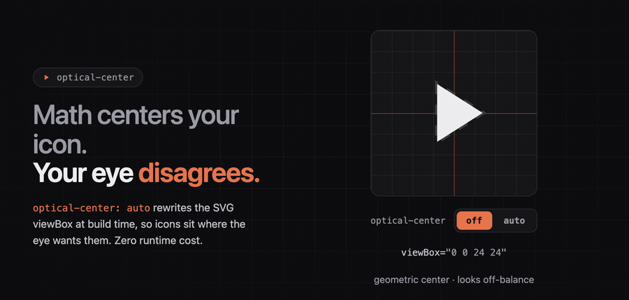

# optical-center

> Bake perceptual centering into your SVG icons **at build time**. Zero runtime cost.

[](https://github.com/Grkmyldz148/optical-center/actions/workflows/ci.yml)
[](#license)

<p align="center">
  
</p>

Geometric center ≠ visual center. A play triangle (▶) dropped at the geometric
midpoint of its box looks pulled to the left; its visual mass sits on the
right. `optical-center` measures where the eye actually wants an icon and
shifts the SVG window to put it there, so the browser ships a flat,
pre-computed result.

```jsx
// you write
<svg optical-center viewBox="0 0 24 24"><path d="M8 5v14l11-7z" /></svg>

// it ships: viewBox rewritten, marker gone, nothing runs in the browser
<svg viewBox="-0.3239 -0.6226 24 24"><path d="M8 5v14l11-7z" /></svg>
```

You opt in with **one declaration on two surfaces**, `optical-center="auto"`
on a JSX / HTML `<svg>`, or `optical-center: auto;` in a CSS rule. An adapter
for your build tool resolves it, runs the pipeline once, and bakes the result
in.

---

## Install

The fastest path is `init`: it detects your framework and package manager,
installs the dependency, and patches the right config file:

```bash
npx optical-center init                 # interactive
npx optical-center init --integration vite --yes
```

Or by hand (requires **Node ≥ 20**):

```bash
npm install optical-center
```

## Quick start: Vite + React

```ts
// vite.config.ts
import { defineConfig } from 'vite';
import react from '@vitejs/plugin-react';
import opticalCenter from 'optical-center/vite';

export default defineConfig({
  plugins: [opticalCenter(), react()],
});
```

```tsx
<svg optical-center viewBox="0 0 24 24" width="24" height="24">
  <path d="M8 5v14l11-7z" />
</svg>
```

After the build, the marker is gone and the `viewBox` is rewritten; no runtime
computation, no CSS to maintain.

---

## Usage by surface

<details>
<summary><b>JSX / React</b>: mark inline <code>&lt;svg&gt;</code></summary>

Mark any inline `<svg>` with `optical-center`. The Vite plugin runs a Babel
pass over `.jsx` / `.tsx` and rewrites the `viewBox` at build time. Dynamic
children or `{...spread}` props bail out safely with a warning.

</details>

<details>
<summary><b>Imported icons</b>: Iconify &amp; friends, automatic</summary>

The Vite plugin also corrects icons you never marked. It recognises icon SVG
that arrives as _data_ (by shape, not by package name) and bakes the optical
shift in at build time:

```ts
import { Icon, addCollection } from '@iconify/react';
import mdi from '@iconify/json/json/mdi.json';

addCollection(mdi);        // the plugin already body-wrapped every icon
<Icon icon="mdi:home" />   // ships pre-corrected; dynamic names work too
```

Opt a module out with `?optical=off`, or scope the pass with
`opticalCenter({ iconData: { exclude } })`.

</details>

<details>
<summary><b>Vanilla HTML</b></summary>

```html
<svg optical-center viewBox="0 0 24 24" width="24" height="24">
  <path d="M8 5v14l11-7z" />
</svg>
```

The Vite plugin rewrites this through `transformIndexHtml`. Outside Vite, the
CLI does the same on a folder of SVGs.

</details>

<details>
<summary><b>CSS (PostCSS)</b></summary>

```js
// postcss.config.js
import opticalCenter from 'optical-center/postcss';
export default { plugins: [opticalCenter()] };
```

```css
.icon-play {
  mask: url('lucide-static/icons/play.svg') center / contain no-repeat;
  optical-center: auto;
}
```

The plugin inlines a corrected `data:image/svg+xml,…` mask. Bare specifiers
resolve through Node; no alias config needed. Works anywhere PostCSS runs (Tailwind,
Next, webpack, postcss-cli, Vite).

</details>

<details>
<summary><b>Astro</b></summary>

```js
// astro.config.mjs
import opticalCenter from 'optical-center/astro';
export default defineConfig({ integrations: [opticalCenter()] });
```

</details>

<details>
<summary><b>Next.js</b> (Webpack &amp; Turbopack)</summary>

```ts
// next.config.ts
import withOpticalCenter from 'optical-center/next';

export default withOpticalCenter({
  // …your usual Next config
});
```

```bash
npm i -D @babel/core   # the loader needs it; Next does not ship it
```

Then mark inline SVGs as usual:

```tsx
<svg optical-center="auto" viewBox="0 0 24 24">
  <path d="M8 5v14l11-7z" />
</svg>
```

`withOpticalCenter` registers one transform on both bundlers — a Webpack
`enforce: 'pre'` rule and the equivalent `turbopack.rules` entry — so the
directive is applied to `.jsx`/`.tsx` **before** SWC compiles them. SWC and the
React Compiler keep doing the actual compilation; unlike a project `.babelrc`,
nothing is opted out of SWC. Imported Iconify/Lucide icon `.json` is corrected
automatically (scoped to icon packages; Webpack by default — pass
`{ turbopackIconData: true }` to extend it to Turbopack).

**Limitations.** No vanilla-HTML / RSC-streamed SVG-string sweep (Next has no
per-page HTML hook). Function-valued options (`onWarning`, `iconPackages`) are
not supported because Turbopack rule options must be JSON-serialisable.

</details>

<details>
<summary><b>Tailwind</b></summary>

```js
// tailwind.config.js
import opticalCenter from 'optical-center/tailwind';
export default { plugins: [opticalCenter] };
```

Adds an `optical-center` utility class. Tailwind ships the directive; the
PostCSS plugin (running **after** Tailwind) resolves it.

</details>

<details>
<summary><b>CLI</b></summary>

```bash
npx optical-center transform ./icons/raw ./icons/centered   # folder → folder
npx optical-center info ./icon.svg                           # one file, full breakdown
```

Full command list and the output contract in the
[reference docs](docs/reference.md#cli).

</details>

---

## Package entry points

One package, several subpath imports. Browser bundlers only ever walk into the
browser-safe `.` entry; native bindings live behind `optical-center/node`.

| Subpath | Use it for |
|---|---|
| `optical-center` | Browser-safe core. `getOpticalCenter()`, `transformViewBox()`, types. |
| `optical-center/node` | Node-only: `rasterizeSvg()`, `transformViewBoxFromSvg()`. |
| `optical-center/cli` | The `optical-center` binary. |
| `optical-center/babel` | Babel plugin: `<svg opticalCenter>` JSX. |
| `optical-center/vite` | Vite plugin: Babel pass + `index.html` + imported icons. |
| `optical-center/astro` | Astro integration (+ dev middleware). |
| `optical-center/postcss` | PostCSS plugin: `optical-center: auto`. |
| `optical-center/tailwind` | Tailwind plugin surface. |
| `optical-center/next` | Next.js adapter: `withOpticalCenter()` (Webpack + Turbopack). |

---

## How it works

The shipped model is **`V2 × 0.745`**, a biologically-inspired pipeline
(Difference-of-Gaussians → centroid blend → symmetry correction) scaled by a
factor measured in a forced-choice perceptual study (humans prefer ~74.5 % of
the raw correction). The full derivation and the internal architecture are in
[`docs/architecture.md`](docs/architecture.md).

> [!NOTE]
> **Open data is coming.** The human-judgment datasets behind the model (the
> Phase 1 method-of-adjustment and Phase 2 2AFC studies) will be released as
> open source, so the perceptual scale can be independently reproduced and
> extended.

## Documentation

| Doc | What's in it |
|---|---|
| [`docs/reference.md`](docs/reference.md) | CLI reference, configuration knobs, programmatic API, warning codes, performance. |
| [`docs/architecture.md`](docs/architecture.md) | The model, the build pipeline, and the internal module layering. |
| [`CONTRIBUTING.md`](CONTRIBUTING.md) | Repo layout, dev/build/test, conventions. |
| [`CHANGELOG.md`](CHANGELOG.md) | Notable changes per version. |
| [`examples/`](examples) · [`apps/playground`](apps/playground) | Runnable demos. |

There's also a full docs site at **[opticalcenter.dev](https://opticalcenter.dev)**
and an interactive **[playground](https://play.opticalcenter.dev)**.

---

## License

Released under the [MIT License](https://opensource.org/licenses/MIT).
